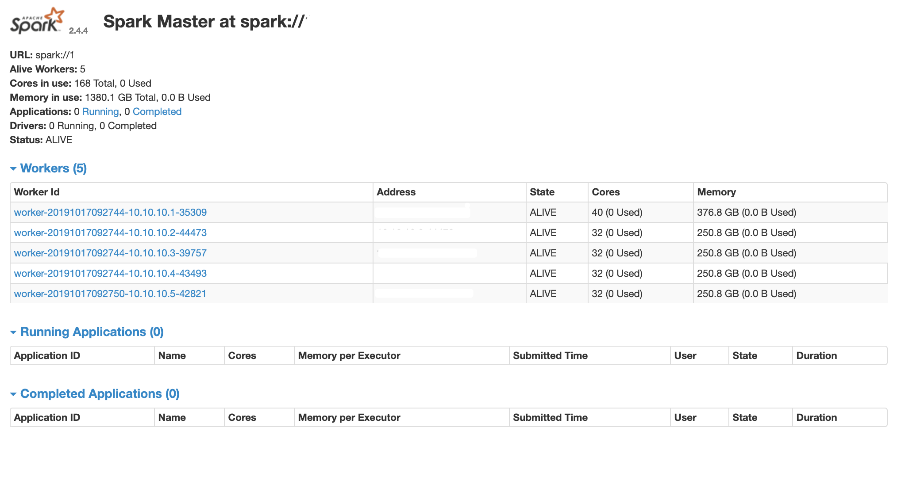

# GraphX-Pagerank
## Overview

Use GraphX Platform to Implement Pagerank Algorithm

## Getting Started

### Hadoop

Go to your favorite directory and download Hadoop soure file

```shell
cd $YOUR_FAVORITE_PATH
wget http://mirrors.tuna.tsinghua.edu.cn/apache/hadoop/common/hadoop-3.2.1/hadoop-3.2.1.tar.gz
tar xzvf hadoop-3.2.1.tar.gz
```

Configure environment variables in `~/.bashrc` (if you use `bash` )

```shell
# Hadoop Variables Start
export JAVA_HOME=/usr/lib/jvm/java-8-openjdk-amd64
export HADOOP=$YOUR_FAVORITE_PATH/hadoop-3.2.1
export PATH=$PATH:$HADOOP/bin:$HADOOP/sbin
export HADOOP_MAPRED_HOME=$HADOOP
export HADOOP_COMMON_HOME=$HADOOP
export HADOOP_HDFS_HOME=$HADOOP
export YARN_HOME=$HADOOP_INSTALL
export HADOOP_COMMON_LIB_NATIVE_DIR=$HADOOP/lib/native
export HADOOP_OPTS="-Djava.library.path=$HADOOP/lib"
# Hadoop Variables End
```

 Your `JAVA_HOME` and `HADOOP` should be adjusted according to your system. 

Change `JAVA_HOME` in `hadoop-env.sh` file

```shell
echo "JAVA_HOME=/usr/lib/jvm/java-8-openjdk-amd64" >> $YOUR_FAVORITE_PATH/hadoop-3.2.1/etc/hadoop/hadoop-env.sh
```

Use `WordCount` program to test the configuration of `hadoop`. 

```shell
hadoop jar share/hadoop/mapreduce/sources/hadoop-mapreduce-examples-3.2.1-sources.jar org.apache.hadoop.examples.WordCount input output
```

## Scala

Go to your another favorite directory and download `scala`

```shell
cd $YOUR_FAVORITE_DIR
wget https://github.com/scala/scala/archive/v2.12.10.tar.gz
tar -xvzf v2.12.10.tar.gz
```

Make change to `~/.bashrc` 

```shell
# Scala Variables Start
export SCALA_HOME=$YOUR_FAVORITE_DIR/scala-2.13.1
export PATH=$PATH:$SCALA_HOME/bin
# Scala Variables End
```

## Spark

Go to your another favorite directory and download `spark` 

```shell
cd $YOUR_FAVORITE_DIR
wget http://mirrors.tuna.tsinghua.edu.cn/apache/spark/spark-2.4.4/spark-2.4.4-bin-hadoop2.7.tgz
tar -xzvf spark-2.4.4-bin-hadoop2.7.tgz
```

Make changes to `~/.bashrc`

```shell
# Spark Variables Start
export SPARK_HOME=$YOUR_FAVORITE_DIR/spark-2.4.4
export PATH=$PATH:$SPARK_HOME/bin
# Spark Variables End
```

Make change to `spark-env.sh`

```shell
cd $YOUR_FAVORITE_DIR/spark-2.4.4/conf
cp spark-env.sh.template spark-env.sh
```

Add configuration 

```shell
export SCALA_HOME=$SCALA_HOME
export JAVA_HOME=$JAVA_HOME
export SPARK_MASTER_HOST=$YOUR_IP_ADDRESSS
export SPARK_MASTER_PORT=7070
```

Add slave information

```shell
cp slaves.template slaves
```

Add configuration

```shell
# A Spark Worker will be started on each of the machines listed below.
localhost
slave2
slave3
slave4
slave5
```

Finally, 



